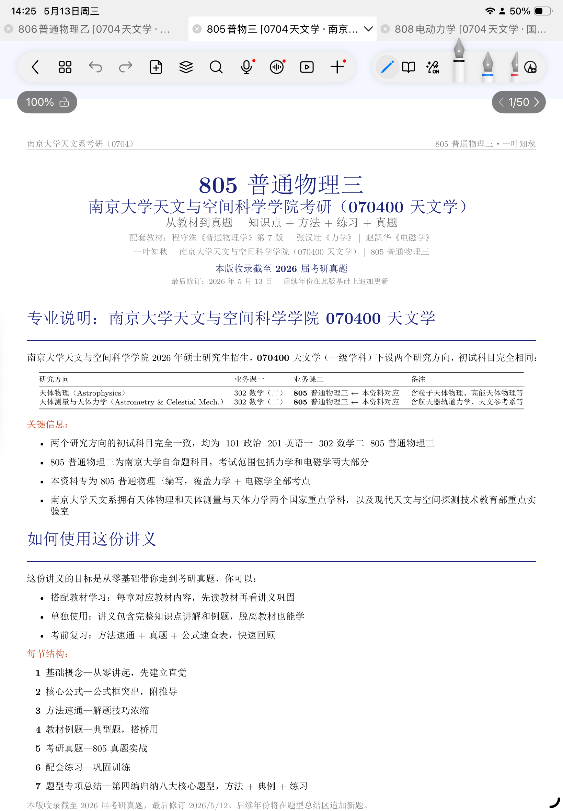
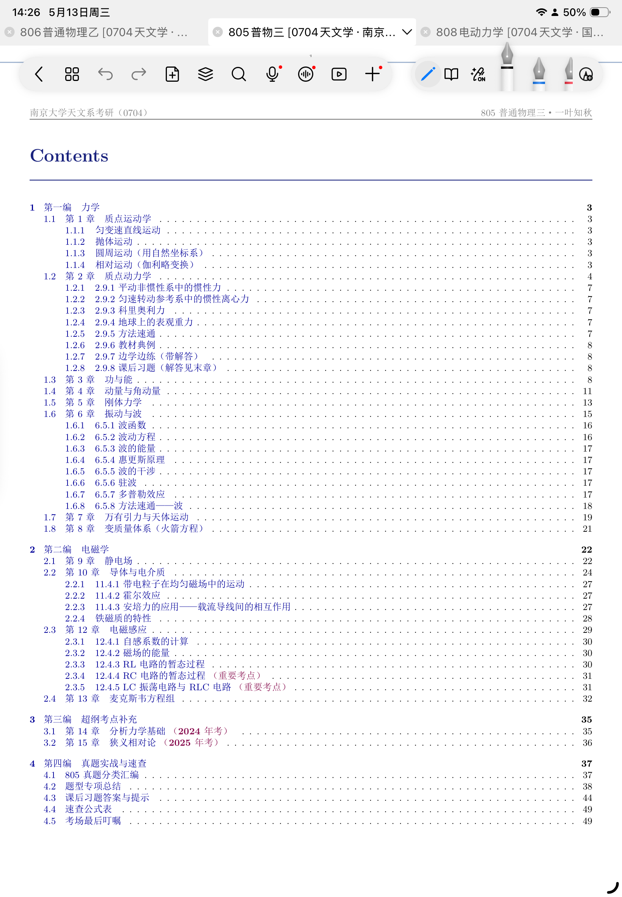
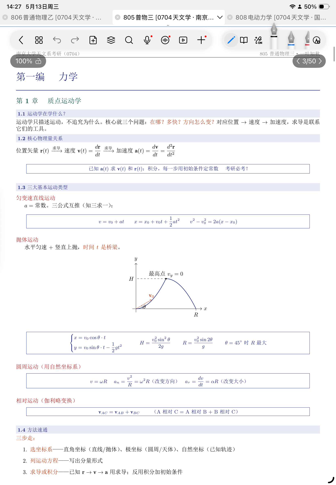
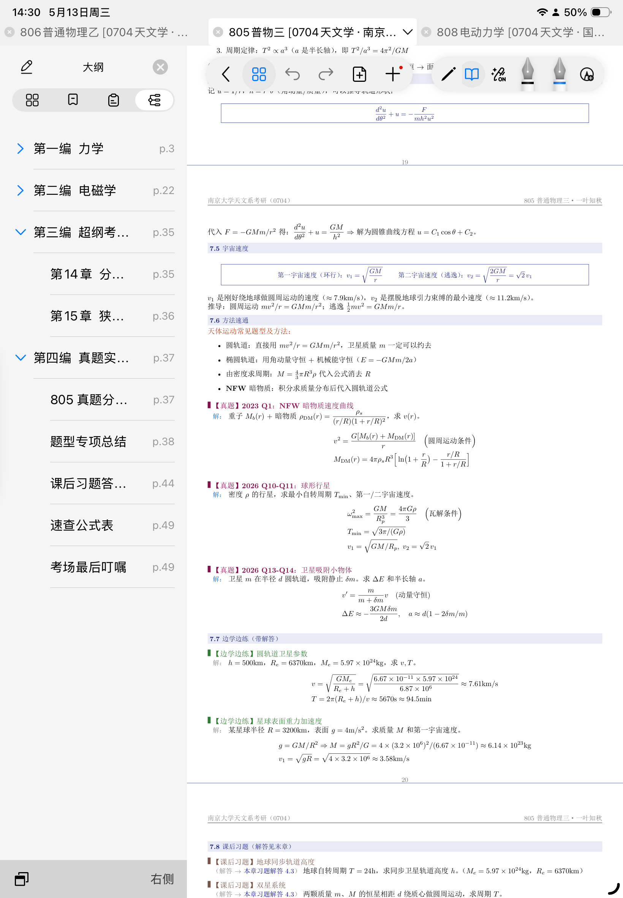
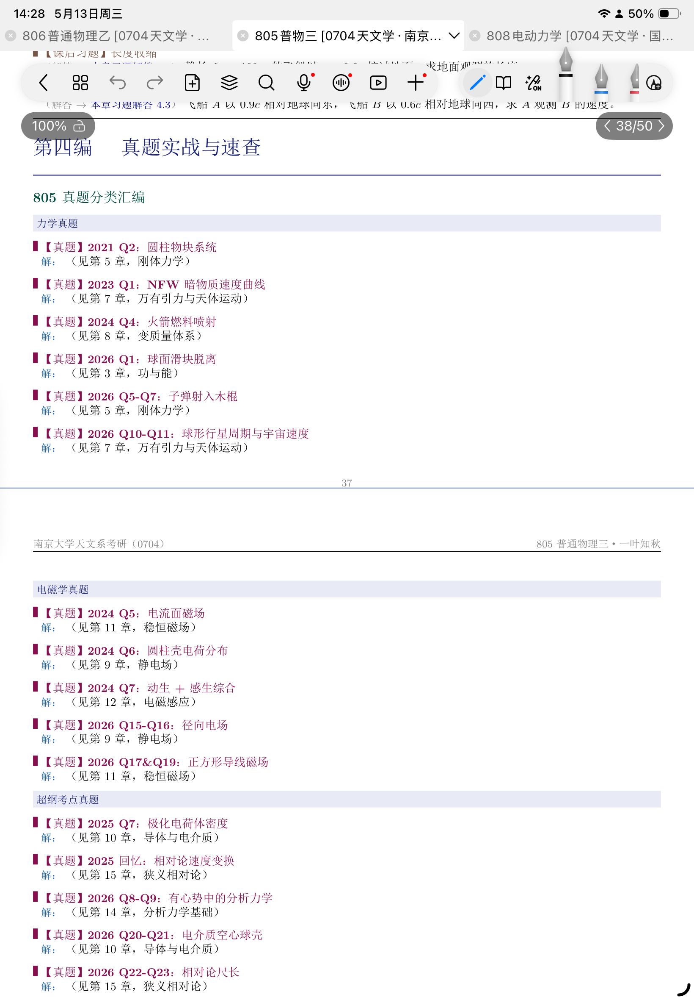
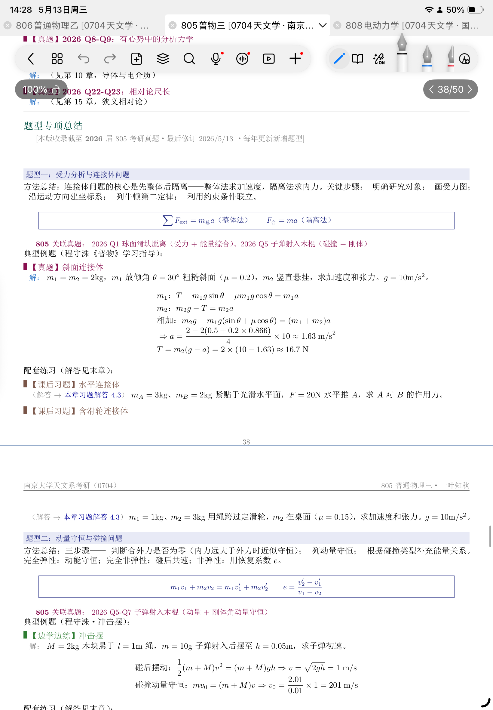

<p align="center">
  
</p>

<h1 align="center">✨ NovaForge</h1>

<p align="center">
  <b>锻造你的知识体系 — 通用知识笔记模板</b><br>
  考研 · 考公 · 专业课 · 科研 · 项目 · 竞赛 · 期末
</p>

<p align="center">
  <a href="#-更新日志">更新日志</a> •
  <a href="#-特性">特性</a> •
  <a href="#-快速开始">快速开始</a> •
  <a href="#-模板体系">模板体系</a> •
  <a href="#-预览">预览</a> •
  <a href="#-核心结构">核心结构</a> •
  <a href="#-跨领域适配">适配指南</a> •
  <a href="#-配套工具">配套工具</a>
</p>

<p align="center">
  
  
  
  
  <a href="NovaForge.skill"></a>
</p>

---

## 📋 更新日志

### 2026/5/16 23:22
- **移除 pdf companion 依赖**：NovaForge 独立完成 LaTeX 编译，不再依赖 pdf skill

### 2026/5/16 23:13
- **新增 .claude/skills/NovaForge.skill**：克隆后 Claude Code 自动识别 `/novaforge` 命令，无需手动复制
- **NovaForge.skill 更新**：
  - Intake 模式选择优化：明确指令直接推断，模糊指令按上下文给出 2~4 个选项
  - 编译格式选择用 AskUserQuestion 交互

### 2026/5/16 12:00
- **修复引号渲染方向**：导言区新增中文引号规范，强制使用 Unicode 弯引号（U+201C/U+201D）
- **消除目录红框**：hyperref 改用 `hidelinks`，去除目录条目链接边框
- **编译清理说明**：模板注释和 Build 流程补充辅助文件（.aux/.log/.out/.toc）清理指引
- **清理 template.tex 死代码**：移除 `\end{document}` 后的残留命令定义
- **修复 Typst 模板语法错误**：修正 `template.typ` 中引号不平衡
- **README 目录树补全**：scripts/ 目录新增缺失的 3 个脚本
- **compile-typst.sh 增强**：新增编译失败的错误处理

### 2026/5/15 23:28
- **新增 Typst 模板版本**：提供 `typst/preamble.typ` + `typst/template.typ`，语法更现代、编译更快（单次编译，无需多遍）
- **三种输出格式**：Intake 流程扩展为 LaTeX（默认）/ Typst / Markdown 三选一
- **NovaForge.skill 同步**：已与本地 SKILL.md 内容完全一致（修复上次遗留问题）
- **README 更新**：新增 Typst 安装指引、模板目录、编译命令

### 2026/5/15 17:47
- **重构 NovaForge 模板体系**：从 3 种模式扩展至 **6 种模式**，新增考研、考公、项目三个专属模式
- **考研模式**：7 步结构 + 考研真题标注（院校+年份+题号）+ 院校专业说明 + 每编题型专项总结
- **考公模式**：行测/申论/面试分模块 + 考点概述 + 核心方法 + 真题标注 + 时政/规范链接
- **项目模式**：架构设计 + 模块详情 + 进度管理 + 问题决策 + 总结复盘完整文档结构
- **科研模式**：新增文献概览表 + 与自身研究关联分析模块（不可缺省）
- **优化 Intake 流程**：用户通过选择题确认模板模式，降低使用门槛
- **新增触发关键词**：整理文献、文献笔记、论文笔记、科研笔记、项目总结、技术方案
- **README 从此条开始记录更新日志**，后续每次更新 GitHub 均需追记

---

## 🎯 这是什么

**NovaForge** 是一份**领域无关**的知识整理与复习资料模板集合。无论你在：

- 📚 **备战考研/考公** — 系统梳理考纲，标注历年真题
- 📖 **学习专业课** — 按章节整理概念+公式+例题
- 🔬 **做科研笔记** — 文献卡片+实验记录+课题思路
- 🏗️ **总结项目** — 架构设计+决策记录+复盘回顾
- 🏆 **冲刺竞赛** — 题型分类+方法总结+限时模拟

> **核心理念**：从零散信息到结构化知识，从被动输入到主动输出。

## ✨ 特性

| 特性 | 说明 |
|------|------|
| **三版本支持** | LaTeX（经典 PDF）/ Typst（现代 PDF）/ Markdown（即写即用） |
| **7 步模块化结构** | 概念→原理→方法→示例→实战→练习→复盘 |
| **领域无关** | 不预设学科，理科文科工科医科均可 |
| **6 种场景模板** | 章节笔记 / 期末复习 / 考研 / 考公 / 科研文献 / 项目总结 |
| **中文原生** | 完整中文排版（xeCJK + 宋体） |
| **一键配色** | 换一行代码即可切换整套视觉风格 |
| **Claude Code 集成** | 提供独立 `.skill` 文件，配合 AI 自动生成笔记 |
| **MIT 开源** | 自由使用、修改、分享 |

## 🚀 快速开始

```bash
# 1. 克隆
git clone https://github.com/SiriusFzh/NovaForge.git
cd NovaForge

# 2. 选择你的版本

#   LaTeX 版（需安装 TeX 发行版）
cd latex
# 编辑 template.tex → xelatex template.tex

#   Typst 版（需安装 Typst）
cd typst
# 编辑 template.typ → typst compile template.typ

#   Markdown 版（任意编辑器打开）
cd markdown
# 直接用 VS Code / Obsidian 编辑 .md 文件

#   Claude Code 集成
# 仓库已内置 .claude/skills/NovaForge.skill，克隆后 /novaforge 直接可用
```

### 安装依赖

**LaTeX 版：**

```bash
# Windows（推荐 TeX Live）
# 下载安装：https://mirrors.tuna.tsinghua.edu.cn/CTAN/systems/texlive/Images/

# macOS
brew install --cask mactex

# Linux
sudo apt install texlive-xetex texlive-latex-extra
```

**Typst 版：**

```bash
# 方式一：Cargo 安装（推荐）
cargo install typst-cli

# 方式二：直接下载二进制
# 访问 https://github.com/typst/typst/releases

# macOS Homebrew
brew install typst

# 编译
typst compile template.typ    # 生成 PDF
typst watch template.typ      # 实时预览（修改后自动重编译）
```

## 📂 模板体系

```
NovaForge/
├── README.md                          # 本文件
├── LICENSE                            # MIT 开源协议
├── .gitignore
├── .claude/                            # Claude Code 集成
│   └── skills/                         #   skill 目录
│       └── NovaForge.skill             #     笔记模板（/novaforge）
│
├── NovaForge.skill                    # ← Claude Code 独立 skill 文件
│
├── assets/                            # 预览图与资源
│   ├── preview-1.png                  #   封面与整体效果
│   ├── preview-2.png                  #   目录与章节结构
│   ├── preview-3.png                  #   公式与知识点展示
│   ├── preview-4.png                  #   真题与例题环境
│   ├── preview-5.png                  #   题型专项总结
│   ├── preview-6.png                  #   公式速查表
│   └── preview-7.png                  #   参考文献与结尾
│
├── latex/                             # LaTeX 版（PDF 输出）
│   ├── preamble.tex                   #   导言区 — 可独立 \input{}
│   └── template.tex                   #   完整可编译模板（封面→目录→正文→附录）
│
├── typst/                             # Typst 版（PDF 输出，语法更现代）
│   ├── preamble.typ                   #   共享样式与自定义函数
│   └── template.typ                   #   完整可编译模板
│
├── markdown/                          # Markdown 版（快速记录）
│   ├── chapter-notes.md               #   章节笔记模板
│   ├── exam-review.md                 #   考前复习冲刺模板（含考情分析+错题本）
│   ├── research-note.md               #   科研文献笔记模板（文献卡片+实验记录）
│   └── project-summary.md             #   项目总结模板（架构+决策+复盘）
│
└── scripts/                           # 配套工具脚本
    ├── new-project.bat                #   Windows: 快速新建项目
    ├── new-project.sh                 #   macOS/Linux: 快速新建项目
    ├── compile.bat                    #   Windows: 一键编译 LaTeX
    ├── compile.sh                     #   macOS/Linux: 一键编译 LaTeX
    ├── compile-typst.bat              #   Windows: 一键编译 Typst
    └── compile-typst.sh               #   macOS/Linux: 一键编译 Typst
```

## 👀 预览

<div align="center">
  
  
  
  
  
  
</div>

## 📐 核心结构

### 7 步模块化结构

每章/每节遵循统一框架，可根据场景灵活裁剪：

```
┌─────────────────────────────────────────┐
│  ① 概念引入    建立直觉，理解"为什么"      │
│  ② 核心原理    公式/原理框 + 逻辑推导      │
│  ③ 方法技巧    解题/实操技巧浓缩           │ ← 不能省略
│  ④ 典型示例    经典例题搭桥                │
│  ⑤ 真题/实战   真实题目/项目实战           │
│  ⑥ 巩固练习    带解答的复盘训练            │
│  ⑦ 总结复盘    易错点 + 思维导图           │
└─────────────────────────────────────────┘
```

### LaTeX 模板核心命令

```latex
\knowtitle{知识点标题}     % 浅蓝灰背景标题栏
\formula{核心公式/原理}    % 带框居中展示
\key{关键术语}            % 橙红强调
\super{拓展内容}          % 紫红超纲标记
\source{来源标注}            % 紫色小字标注

\begin{exampenv}{标题}    % 案例/例题环境（自动带"分析："）
  ...题目和解答...
\end{exampenv}

\begin{pracenv}{标题}     % 练习/复盘环境（带解答）
  ...练习内容...
\end{pracenv}
```

解题注释格式（LaTeX 版）：
```latex
\[\begin{aligned}
  F &= ma \quad\Big(\text{牛顿第二定律，合力产生加速度}\Big) \\
  a &= \frac{v^2}{r} \quad\Big(\text{圆周运动向心加速度公式}\Big)
\end{aligned}\]
```

> 所有注释必须解释**为什么这么做**，而非只展示数学推导。

## 🧭 跨领域适配指南

| 场景 | 推荐模式 | 微调建议 |
|------|---------|---------|
| **考研** | 考研模式（章节 7 步 + 真题标注） | 按考纲分章，标注院校+年份+题号 |
| **考公** | 考公模式（行测/申论/面试） | 题型模块化，时政链接 |
| **专业课学习** | 章节笔记模式（7 步结构） | 同步教材章节，每课一记 |
| **科研** | 科研模式（文献笔记） | 文献卡片 + 方法归纳 + 关联分析 |
| **项目总结** | 项目模式（架构+进度+复盘） | 架构图 + 决策记录 + 复盘 |
| **竞赛** | 期末复习模式 | 题型分类 + 方法模板 + 限时策略 |
| **期末复习** | 期末复习模式 | 精简版，聚焦考点+公式+典型题 |

## 🎨 自定义

### 一键换色

修改 `latex/preamble.tex` 中的 `\definecolor{titlecolor}`：

```latex
%% 理科冷静蓝（默认）
\definecolor{titlecolor}{HTML}{1a237e}

%% 文科典雅红
\definecolor{titlecolor}{HTML}{8b0000}

%% 清新自然绿
\definecolor{titlecolor}{HTML}{2e7d32}

%% 活力竞赛橙
\definecolor{titlecolor}{HTML}{e65100}
```

### 移除数学支持（非理工科）

```latex
%% ── 数学/公式（非理工科可注释掉） ──
% \usepackage{amsmath,amssymb,amsthm}
% \usepackage{cancel}
% \usepackage{physics}
% \usepackage{mathrsfs}
% \usepackage{bm}
```

### 新建项目

```bash
# Windows
scripts\new-project.bat 我的考研笔记

# macOS / Linux
bash scripts/new-project.sh 我的考研笔记
```

## 🤖 Claude Code 集成

NovaForge 提供独立 `.skill` 文件，可直接用于 Claude Code：

```bash
# 1. 下载 skill 文件
# 从 GitHub 下载 NovaForge.skill，或直接从仓库根目录获取

# 2. 放入 Claude Code skill 目录
cp NovaForge.skill F:/.claude/skills/

# 3. 在 Claude Code 中调用
# /NovaForge "帮我整理量子力学的复习笔记"

# 或加载后使用
# skill NovaForge
```

### Skill 工作流程

```
Intake → 理解知识结构 → 按章节/主题分块 → 派发写手 →
合并结构草稿 → 校验器审核 → 生成模板文件 → 编译 PDF → 最终检查
```

- **Controller**：确认需求、全局理解、分块规划、合并、生成文件
- **Segment Writer**：每块按对应模式结构独立编写
- **Verifier**：检查覆盖完整度、结构完整性、公式/内容准确性

### 6 种模板模式

Skill 支持以下 6 种模式，Intake 阶段通过选择题确认：

| 模式 | 适用场景 | 核心结构 |
|------|---------|---------|
| **章节笔记模式** | 系统学习新知识 | 7 步结构（概念→公式→方法→示例→真题→练习→复盘） |
| **期末复习模式** | 备考冲刺 | 考法→真题(标签)→方法→练习留白→答案末尾 |
| **考研模式** | 考研专业课 | 7 步 + 考研真题(标注院校+年份) + 题型专项总结 |
| **考公模式** | 公务员/事业单位 | 考点→方法→真题→练习→时政链接 |
| **科研模式** | 文献整理/研究笔记 | 背景→方法→结果→创新→局限→关联 |
| **项目模式** | 项目文档/技术总结 | 概览→架构→模块→进度→问题→复盘 |

### 图片优先

Skill 会在必要时自动用 tikz（LaTeX）生成辅助理解的示意图。

### 输出规范

- 默认输出文件夹：`NovaForge-Output-<project-name>/`
- LaTeX 模式：`.tex` + 编译 `.pdf`
- Typst 模式：`.typ` + 编译 `.pdf`
- Markdown 模式：`.md`
- 所有文件在该文件夹内，不散落在外

> `.skill` 文件为独立文件，下载单个文件即可使用，无需克隆整个仓库。

## 🛠 编译与排错

```bash
# LaTeX 一键编译（Windows）
scripts\compile.bat

# LaTeX 手动编译
cd latex
xelatex template.tex    # 第 1 遍：生成 .toc
xelatex template.tex    # 第 2 遍：解析引用

# Typst 编译（一次完成，无需多遍）
cd typst
typst compile template.typ

# 清理中间文件
rm *.aux *.log *.out *.toc
```

### 常见问题

| 问题 | 原因 | 解决 |
|------|------|------|
| 目录为空（0 bytes） | `\formula{` 缺闭合 `}` | 全文搜索 `\formula{` 检查闭合 |
| `\cancel` 未定义 | 缺少宏包 | 导言区加 `\usepackage{cancel}` |
| PDF 只有部分页面 | 编译中断 + .toc 未更新 | 修复错误后 3 遍编译 |
| 中文显示为方框 | 缺少 SimSun 字体 | 安装中文字体或换用系统自带宋体 |

## 🤝 贡献指南

欢迎通过 Issue 和 PR 贡献：

1. **新模板**：添加更多场景的模板
2. **配色方案**：贡献更多一键换色配置
3. **示例**：分享你用 NovaForge 整理的学科笔记到 `examples/`
4. **Bug 修复**：LaTeX 编译问题、环境兼容性

## 📄 License

MIT License — 自由使用、修改、分享。

---

<p align="center">
  <b>NovaForge</b> — 锻造你的知识体系<br>
  <sub>Built with ❤️ for learners everywhere</sub>
</p>
